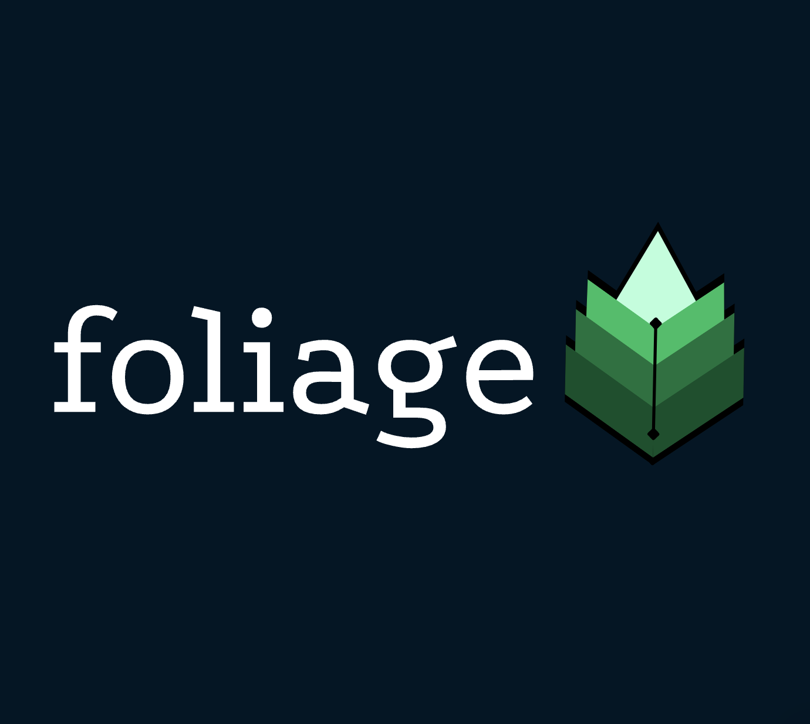

This project is a developer tool track project for hackillinois




Foliage is a developer tool that simplifies the process of development and version control through generating a tree version history structure users can interact easily with and visualize.


How to run:

pip install all needed packages:
```
matplotlib
flask
CORS
```

Run flask (dev server):
```
flask run
```

Open `tree1.html` to view our main website. Enjoy!